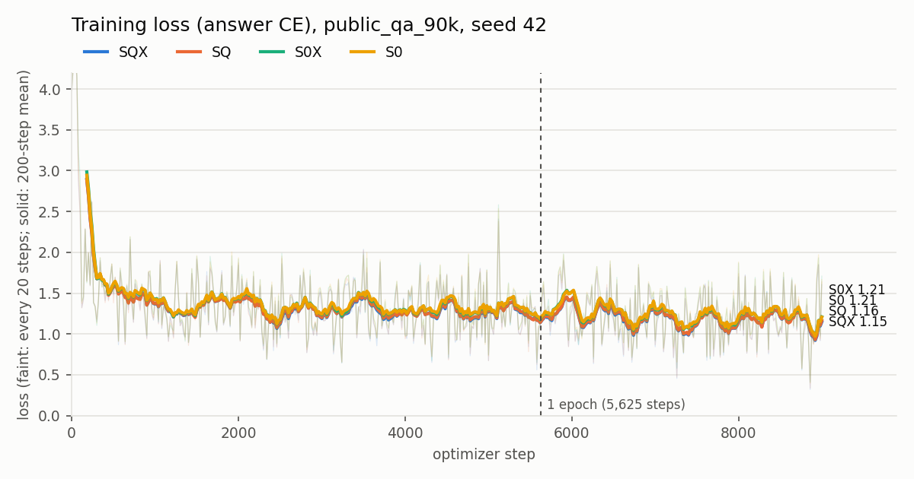
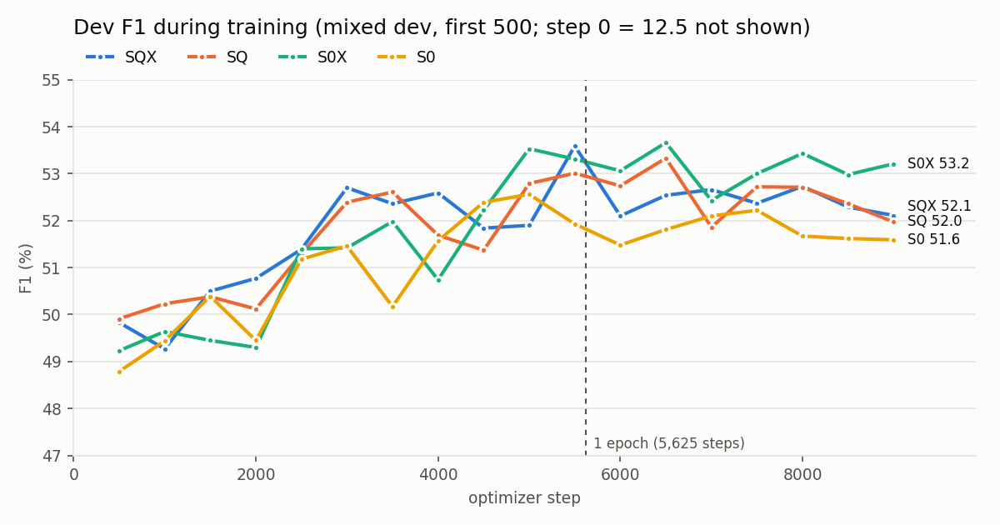

# 公开混合问答集训练：数据构造、四臂训练与 HotpotQA 测试

日期：2026-10-09。分支：`feat/pisco-joint-query-projector`，协议见 [`PUBLIC_QA_TRAINING.md`](PUBLIC_QA_TRAINING.md)（827e294）。

**结论：在公开 10 来源混合集上训练（90k 问题，单 seed）后，在 HotpotQA test 上，四个混训投影器都比同结构的 HotpotQA 专项训练低约 13–15 F1（§3.4），substring 也比原始 PISCO 低 7–11 个百分点。四臂之间，SQ 最好；主模型 SQX 显著低于 SQ（F1 −1.68）。这批结果不支持"扩大到混合训练能提升 SQX"。**

## 1. 数据构造

### 1.1 问题池与评测排除

- 来源：`dmrau/multi_qa`，固定 revision `b0b01e2a…`，parquet SHA256 `ca0cd7ce…`，共 453,023 行。
- 导出：`prepare_public_qa.py export --limit 90000 --seed 42 --dev_fraction 0.01`，得到 train 90,000、dev 4,541（按规范化问题分组划分）。
- 评测排除共去掉 747 条重合题，排除了以下文件：
  - HotpotQA dev/test（`/data02/quro/data/hotpot{,_full}/`）、TriviaQA（`/data02/quro/data/trivia/queries.jsonl`）；
  - NQ-open validation（3,610）、PopQA test（14,267）、WebQuestions test（2,032）。后三个经 hf-mirror 下载，存于 `/data02/quro/data/eval_sets/`。
- **未排除 ASQA 和 FactKG**：两者在 mirror 上需要授权，没有下载到评测题。
- 长度审计（Mistral-v0.2 tokenizer）：128 target / 256 query 下无超限。

训练集来源分布：

| 来源 | 行数 | 来源 | 行数 |
|---|---:|---|---:|
| HotpotQA | 17,547 | MS MARCO | 11,862 |
| SQuAD | 17,526 | AdversarialQA | 5,977 |
| NQ-open | 17,476 | FreebaseQA | 3,953 |
| TriviaQA | 12,373 | SciQ | 2,269 |
| ASQA | 850 | WikiQA | 167 |

### 1.2 检索：SPLADE-v3 + DeBERTa-v3，kilt-128，top-5

按 PISCO §4.1 的做法，用户选定作者协议。实现见 `scripts/build_splade_retrieval.py`，由 `scripts/run_splade_pipeline.sh` 串联。

| 阶段 | 设置 | 实际耗时 |
|---|---|---|
| 语料 | `dmrau/kilt-128`，43 个 parquet，共 21,022,314 段（`content` 字段），文档 ID 为 `kilt128:<id>` | 四路并行下载 |
| 编码 | `naver/splade-v3`，fp16，段落截断 256 token；每段约 228 个非零项；4 卡 | 72 分钟 |
| 首阶段检索 | 稀疏点积，每题保留前 50 | 83 分钟 |
| 重排 | `naver/trecdl22-crossencoder-debertav3`，fp16，保留前 5；4 卡 | 61 分钟 |

- 首阶段深度 50 是参照 BERGEN 的选择，PISCO 论文没有写明，可能与作者实际设置不同。
- 这是"公开问题池 + 本项目按作者协议重建的检索"，不是作者发布的 top-5 映射（作者没有公开该映射）。

### 1.3 Attach 与缓存

- `prepare_public_qa.py attach --max_docs 5`：94,541 题全部按源 ID 匹配，无缺失。共 400,653 个不同段落需要压缩。
- PISCO 缓存：`build_hotpot_cache.sh` 四卡分片，生成 `/data02/quro/cache/public_qa_pisco_r16`（m=8、h=4096、fp16），合并后经过逐字节往返校验；约 34 分钟。
- `check_rag_data.py`：train/dev 缓存覆盖率 100%，PASS。

## 2. 训练

| 设置 | 值 |
|---|---|
| 臂 | SQX（query+跨文档）、SQ（query）、S0X（跨文档）、S0（都无） |
| seed | 42，`--data_order_seed 42`；四臂 step0 dev 分数、step1 loss 完全一致 |
| 预算 | 9,000 步，batch 2 × accum 8（约 144k 次样本呈现，约 1.6 遍），lr 5e-5 |
| 长度 | K=5，max_query_len 256，max_answer_len 128，生成上限 128 |
| 冻结 | PISCO compressor、decoder 与 LoRA；只训投影器 |
| 选择 | 每 500 步在 dev 前 500 题评估，按 EM 选 best |

日志：`/data02/quro/runs/public_qa_90k/{arm}_s42.log`；checkpoint：`/data02/quro/runs/public_qa_90k/seed42/{arm}/`。

混合集 dev（2,000 题，last checkpoint）：

| 臂 | EM | F1 | best（dev500 EM）步 |
|---|---:|---:|---:|
| SQX | 41.15 | 52.0 | 4000 |
| SQ | 41.10 | 51.5 | 6500 |
| S0X | 41.80 | 52.1 | 6500 |
| S0 | 40.95 | 51.2 | 5000 |

**这些 dev 分数只用于选 checkpoint 和确认收敛，不是方法比较的证据。**

### 2.1 训练曲线与逐步日志

逐步日志（每 20 步一行训练记录，每 500 步一行 dev500 验证）和绘图脚本在 [`../results/public_qa_90k/`](../results/public_qa_90k/)：`{arm}_s42_train_log.jsonl`、`plot_curves.py`。

各段平均训练 loss：

| 臂 | 1–1000 | 2000–3000 | 4000–5000 | 6000–7000 | 8000–9000 |
|---|---:|---:|---:|---:|---:|
| SQX | 1.778 | 1.280 | 1.270 | 1.214 | 1.189 |
| SQ | 1.773 | 1.287 | 1.278 | 1.224 | 1.193 |
| S0X | 1.824 | 1.323 | 1.313 | 1.264 | 1.238 |
| S0 | 1.820 | 1.324 | 1.323 | 1.272 | 1.240 |

- loss 在前约 500 步从 4.0 降到 1.5 左右，之后下降很慢：从 2000–3000 步到 8000–9000 步只降了约 0.09。
- 第一遍结束（第 5,625 步）后进入第二遍，loss 没有明显的再次下降，说明 90k 题在当前学习率下已基本学到平台。
- 混合 dev F1 在 5000–6500 步达到峰值（SQX 53.59、SQ 53.33、S0X 53.66、S0 52.56），之后持平或略降。

### 2.2 训练规模

| | 本轮 | 公开问题池 |
|---|---:|---:|
| 训练问题数 | 90,000 | 453,023（去除评测重合与无效后可用 447,689） |
| 样本呈现次数 | 约 144k（9,000 步 × 16） | — |

本轮只用了公开池的约 20%，每题约见 1.6 次。PISCO/COCOM 论文使用整个 453k 池（PISCO §4.1）；它们的训练轮数和 batch 本次没有核对原文，不在此给出。它们训练的是 compressor 与 decoder 的 LoRA，本项目只训投影器，所以训练量不能按参数量直接对照。

上面的曲线显示，在 90k 子集上加步数（更多遍）的收益已经很小；用更多不同的问题能否提升，需要用全量 447k 实际训练才能回答。

## 3. HotpotQA test 评测

### 3.1 设置

- 测试集：HotpotQA distractor test，K=10（每题 10 篇原生段落），缓存 `hotpot-pisco-r16`。
- checkpoint：各臂的 best。
- 注意：训练时每题只有 K=5 篇检索段落，测试时是 K=10，测试条件与训练条件不同。

两个参照：

- **原始 PISCO**：`shared_projector_v1/published_direct`，发布版权重，不训投影器。它只在 test 前 2,000 题上跑过。PISCO 没有对齐短答案格式，输出是整句（预测中位 19 词），所以 EM/F1 很低，只有 substring 有意义。
- **HotpotQA 专训 S0**：`query_ablation/s0_s42`，只在 HotpotQA K=10 训练集上训练 3,000 步。训练分布与测试一致，是"领域内训练"的上限参照，不是 PISCO 基线。

本轮第一次跑基线时误用了 `pisco_hotpot` preset（B=8，readout 不同），得到 EM 0.20%，该结果作废。

### 3.2 与参照对比（test 前 2,000 题，同题配对）

| 模型 | EM | F1 | substring | substring − PISCO 原始（95% CI） |
|---|---:|---:|---:|---|
| PISCO 原始 | 0.90 | 16.41 | 49.90 | — |
| HotpotQA 专训 S0 | 51.10 | 65.55 | 55.55 | +5.65 [+3.25, +7.90] |
| 混训 SQX | 38.60 | 50.76 | 41.40 | −8.50 [−10.85, −6.35] |
| 混训 SQ | 39.85 | 52.28 | 42.45 | −7.45 [−9.80, −5.15] |
| 混训 S0X | 37.35 | 49.76 | 39.35 | −10.55 [−12.80, −8.30] |
| 混训 S0 | 37.85 | 50.38 | 40.75 | −9.15 [−11.50, −7.00] |

substring 衡量 gold 是否出现在输出中，不受 PISCO 长句格式影响，所以用它和原始 PISCO 比较。

- 四个混训臂都学会了短答案格式（预测中位 2 词），EM/F1 因此远高于原始 PISCO。
- 但它们的 substring 显著低于原始 PISCO：**混训投影器在 HotpotQA 上损失了答案内容**，不只是格式变了。
- HotpotQA 专训 S0 的 substring 高于原始 PISCO，说明在领域内训练时，投影器能同时改善格式和内容。

### 3.3 四臂比较（完整 test，5,405 题）

| 臂 | EM | F1 | substring | bridge F1（4,296） | comparison F1（1,109） |
|---|---:|---:|---:|---:|---:|
| SQX | 38.56 | 50.84 | 41.63 | 47.47 | 63.91 |
| SQ | 40.07 | 52.52 | 43.03 | 48.65 | 67.50 |
| S0X | 37.93 | 49.97 | 40.39 | 46.38 | 63.88 |
| S0 | 38.11 | 50.37 | 41.30 | 46.84 | 64.04 |

同题配对 F1 差（百分点，95% bootstrap CI）：

| 对比 | 全部 | bridge | comparison |
|---|---|---|---|
| SQX − SQ | **−1.68** [−2.48, −0.89] | −1.19 [−2.02, −0.37] | −3.59 [−5.72, −1.52] |
| SQX − S0X | +0.87 [+0.09, +1.68] | +1.09 [+0.23, +1.95] | +0.03 [−1.94, +2.02] |
| SQ − S0 | **+2.15** [+1.37, +2.91] | +1.81 [+0.98, +2.63] | +3.46 [+1.43, +5.39] |
| S0X − S0 | −0.40 [−1.10, +0.33] | −0.46 [−1.22, +0.33] | −0.16 [−1.80, +1.48] |
| SQX − S0 | +0.47 [−0.32, +1.19] | +0.62 [−0.23, +1.50] | −0.13 [−2.00, +1.87] |

CI 只反映题目抽样；单 seed，不含训练随机性。各臂的 best 选在不同步数（4000–6500），所以臂间差值也包含选点差异。

### 3.4 与 HotpotQA 专项训练的差距（完整 test，5,405 题）

专项训练指只用 HotpotQA distractor 训练集（30k 题，K=10，max_answer_len 48），3,000 步，batch 2 × accum 8，lr 5e-5，last checkpoint。数字由各 run 的预测文件重新计算。

| 臂 | 训练 | EM | F1 | substring | bridge F1 | comparison F1 |
|---|---|---:|---:|---:|---:|---:|
| S0 | 专训 s42 / s43 | 50.90 / 51.10 | 65.21 / 65.20 | 55.54 / 55.80 | 63.82 / 63.81 | 70.62 / 70.56 |
| S0 | 混训 s42 | 38.11 | 50.37 | 41.30 | 46.84 | 64.04 |
| SQ | 专训 s42 / s43 | 51.19 / 51.38 | 65.52 / 65.62 | 55.97 / 56.06 | 63.77 / 64.14 | 72.29 / 71.37 |
| SQ | 混训 s42 | 40.07 | 52.52 | 43.03 | 48.65 | 67.50 |
| SQX | 专训（10-03，单 seed） | 51.84 | 66.21 | 56.58 | 65.05 | 70.74 |
| SQX | 混训 s42 | 38.56 | 50.84 | 41.63 | 47.47 | 63.91 |

- 同一结构下，混训比专训低约 13–15 F1、约 11–13 EM。bridge 题差距最大（约 −15 至 −17 F1），comparison 题较小（约 −3 至 −7 F1）。
- 专训的 SQX 来自 10-03 首轮，没有固定数据顺序；顺序对齐后的两 seed 专训 SQX 只在 dev 上评测过，没有完整 test，见 [`CROSS_DOCUMENT_PROJECTOR_RESULTS.md`](CROSS_DOCUMENT_PROJECTOR_RESULTS.md)。
- 两种训练在数据来源、K（10 对 5）、证据来源（原生段落对检索段落）、答案上限（48 对 128）和步数上都不同，以上差距是这些因素的合计，本轮不能拆分。

## 4. 解读

1. **混合训练在 HotpotQA 上不如领域内训练。** 可能的原因有几个，本轮无法区分：
   - 训练分布中 HotpotQA 只占约 19%；
   - 训练时每题 K=5 段（kilt-128 检索），测试时是 K=10 原生段落；
   - 9,000 步对 90k 混合数据只有约 1.6 遍。
2. **query 分支在混训下有效**：SQ−S0 = +2.15 F1，CI 不跨零，bridge 和 comparison 题都为正。这比在 HotpotQA 专训下的 +0.37 更明显。
3. **跨文档 attention 没有收益，叠在 query 分支上反而有害**：
   - S0X−S0 接近零；
   - SQX−SQ = −1.68，CI 不跨零，comparison 题上 −3.59。
   - 一个可能的原因是 SQX 的 best 选在第 4000 步，早于其他臂；这一点未验证。
4. 与 HotpotQA 专训下的跨文档验证（[`CROSS_DOCUMENT_PROJECTOR_RESULTS.md`](CROSS_DOCUMENT_PROJECTOR_RESULTS.md)，SQX−SQ +0.33，CI 跨零）相比，这次方向相反。两者的训练数据、K 和步数都不同，不能直接对照。

## 5. 未完成与边界

- 只测了 HotpotQA。NQ、PopQA、WebQuestions 只有问题和答案，没有检索结果，需要先用同一 SPLADE/DeBERTa 管线检索并建缓存；TriviaQA 缓存已建（`trivia-pisco-r16`），但还没评测。
- 只有 seed42。
- ASQA、FactKG 的评测题没有从训练集排除。
- 原始 PISCO 的参照只覆盖 test 前 2,000 题。

## 6. 工程记录

- **代理**：tmux 全局环境里设了 `HTTP(S)_PROXY=127.0.0.1:7897`，但代理进程没在运行。hf-mirror 会把文件下载重定向到 `cas-bridge.xethub.hf.co`，这一请求走了失效代理，于是下载失败。`download_kilt128.py` 用 `trust_env=False` 绕开，并对每个 shard 重试直到成功。
- **依赖版本**：安装 sentence-transformers 时，pip 顺带把 transformers 升到 5.19.0，PISCO 无法加载。已恢复为 transformers 4.57.6 + sentence-transformers 5.1.2（tokenizers 0.22.2）。
- **启动脚本**：第一次启动训练时，多行字符串变量在换行处被拆开，报 `--seed: command not found`，四臂都没有跑起来。已改为在 tmux 命令中逐行写出参数。
- **评测参数**：`--eval_only --resume_from` 需要显式传入与训练一致的 `--projector_query_mode`/`--projector_cross_document`，否则加载 checkpoint 时会报布局不匹配。

| 文件 | 作用 |
|---|---|
| `scripts/download_kilt128.py` | kilt-128 shard 下载，可多路并行 |
| `scripts/build_splade_retrieval.py` | encode / search / rerank 三阶段，均可断点续跑 |
| `scripts/run_splade_pipeline.sh` | 等 shard 齐全并校验后，串联三阶段 |
| `scripts/run_public_qa_train.sh` | attach → 缓存 → 覆盖检查 → 四臂训练 |

结果文件：`/data02/quro/runs/public_qa_test_eval/{arm}/hotpot/`。
